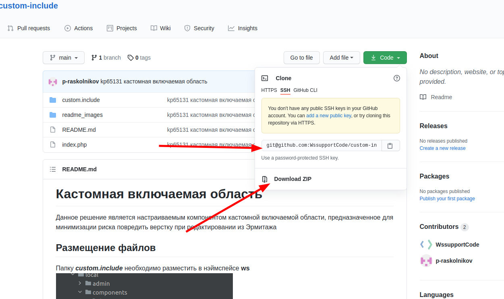
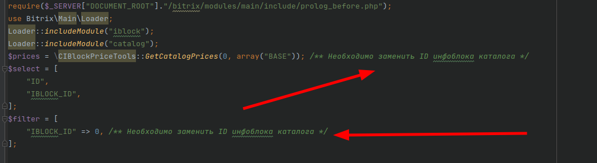
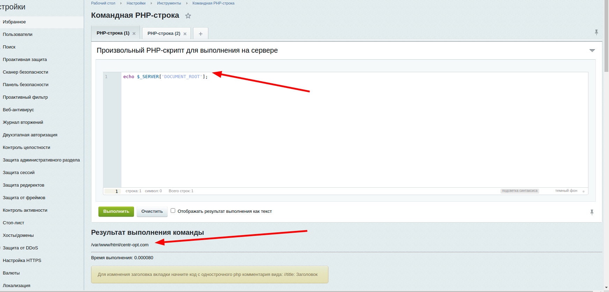
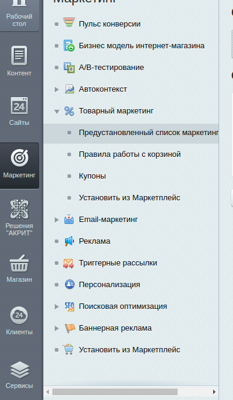

# Признак "Товар со скидкой"

Данное решение позволит легко определять товары со скидкой, 
а также быстро получать эту скидку в процентах(или в денежных единицах).

## Создание свойства

Свойство **DISCOUNT** - "Скидка" будет создано после применения миграции. 
Файл миграции находится в корне репозитория.

Для того, чтобы получить файлы решения,
вы можете либо скачать архив в формате ZIP,
либо при помощи команды **git clone <репозиторий>**

скопировать файлы к себе на локальный компьютер или напрямую на сервер.

## Агент

Файл агента лежит в **/local/php_interface/include/cron/discount_checker.php**
Его следует разместить по аналогичному пути на проекте.

В коде агента нужно заменить ID инфоблока каталога 

Далее необходимо внести запись в cron. Для этого нужно зайти на сервер и выполнить команду **crontab -e**.

**!!! Важно !!! Редактировать расписание cron нужно очень аккуратно, так как в режиме редактирования 
можно затереть уже существующие задачи**

Если записи уже есть, то делаем нашу запись в том же формате что и существующие, частоту выполнения устанавливаем 
какую удобно (шпаргалка по настройке cron - https://1cloud.ru/help/linux/kak-nastroit-planirovshchik-cron-na-crontab-linux). Путь к папке сайта на сервере получаем выполнив команду
**echo $_SERVER["DOCUMENT_ROOT"];** в командной PHP-строке на сайте.

Дальше просто дописываем наш путь к нашему файлу **/local/php_interface/include/cron/discount_checker.php**

## Тестирование

Для тестирования нужно создать тестовую скидку для тестового товара

После этого установить время запуска агента на текущее время + 1-2 минуты.

Далее подождать какое-то время, чтобы агент полностью отработал. (время работы зависит от количества товаров)
Потом проверяем значение свойства "Скидка" у тестируемого товара.

## Заключение 

Данный функционал упрощает реализацию вывода скидки в каталоге, сортировку/фильтрацию по размеру и наличию скидки.
